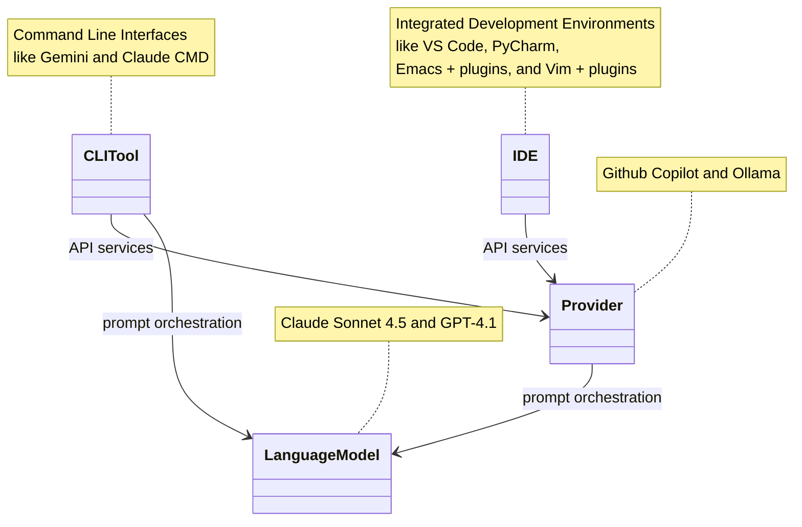

# Terminology

## Relationships between components

The diagram below shows several parts that together provide an AI-assisted code development environment.

## IDE

An IDE is an *integrated development environment*.
These typically provide an editor and a mechanism (and API) for writing plugins, which add functionality to the IDE.
Such plugins provide abilities like building the code (compiling and linking, for compiled languages), running tests, and debugging code.
They can also provide facilities for interaction with source code control systems, such as *git*.

Some example IDEs are *Visual Studio Code*, *IntelliJ*, and both *emacs* and *vim* with appropriate installed extensions.

## Provider

A provider is an IDE plugin that provides the ability to interact with some language model.
It typically provides a mechanism by which the user can submit prompts to the model.
It also typically provides a mechanism by which the code being developed can be send as context to the model, and code generated by the model can be brought back to the development environment.

## Language Model

A language model is an AI predictive model that accepts user prompts and provides responses.
The responses may include generated code, or commands to manipulate the code is some way -- such as compiling code, or running tests.

## CLI tool

A CLI tool is a command-line program that allows the user to interact with a language mode.
It may make use of a plugin mechansim, and interact with a language model through a provider, or it may interact directly with a specific language model.

