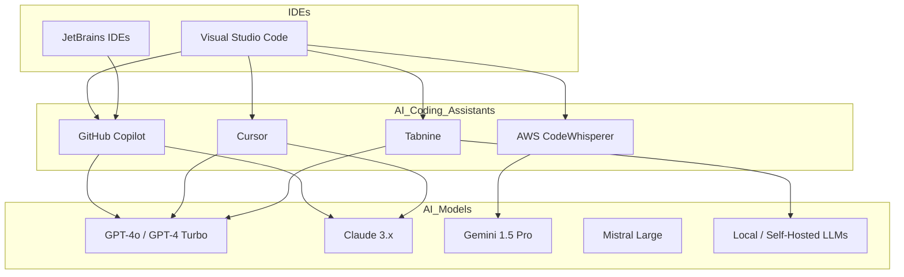

# AI Coding Assistant Ecosystem — IDE Integrations

Paste the diagram below into any Mermaid-compatible viewer (for example, VS Code Markdown preview or the [Mermaid Live Editor](https://mermaid.live/)) to see the relationships rendered visually.

