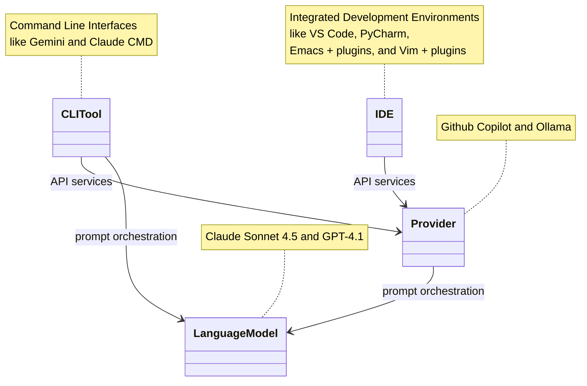

# Terminology

## Relationships between components

The diagram below shows several parts that together provide an AI-assisted code development environment.

## IDE

An IDE is an *integrated development environment*.
These typically provide an editor and a mechanism (and API) for writing plugins, which add functionality to the IDE.
Such plugins provide abilities like building the code (compiling and linking, for compiled languages), running tests, and debugging code.
They can also provide facilities for interaction with source code control systems, such as *git*.

Some example IDEs are *Visual Studio Code*, *IntelliJ*, and both *emacs* and *vim* with appropriate installed extensions.

## Provider

A provider is an IDE plugin that provides the ability to interact with some language model.
It typically provides a mechanism by which the user can submit prompts to the model.
It also typically provides a mechanism by which the code being developed can be send as context to the model, and code generated by the model can be brought back to the development environment.

## Language Model

A language model is an AI predictive model that accepts user prompts and provides the most likely response based on the examples of language it has been exposed to.
The responses may include generated code, or commands to manipulate the code is some way -- such as compiling code, or running tests.
Different language models have been _fine tuned_ (had its weights updated to favor particular kinds of responses) for certain activities, which will be a factor in deciding which model to use for a task. 

## CLI tool

A CLI tool is a command-line program that allows the user to interact with a language mode.
It may make use of a plugin mechanism, and interact with a language model through a provider, or it may interact directly with a specific language model.

## Prompt

A prompt is a type of directive a language model is given to produce a response. 
A prompt can include both a specific instruction (e.x. Write code to do this thing, summarize a document), and _context_ - the additional text you wish for the model to consider (e.g. a PDF, a set of scripts). 

A _System Prompt_ is a global prompt the model always uses before a user prompt to guide behavior. 
This can be practical things like "If you are unsure if a library exists or not, do not include it in the code" (A known method to reduce model hallucinations) or more frivolous options like "Respond to everything like you are in a broadway musical".

## MCP (Model Context Protocol)

MCP is a protocol used to connect models to different systems. 
They exist as client/server pairs that connect to a service (e.g. database or other file system) and relay them to the model. 
Common MCPs include things like live web search. 
Think of them as different plugins a model can use if so called upon. 

